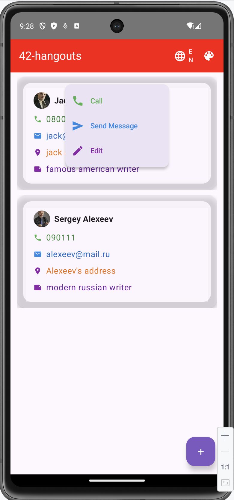

# ft_hangouts

A modern Android contacts and messaging application built with Jetpack Compose and Kotlin.

## 📱 Features

### Core Functionality
- **Contact Management**: Create, edit, and delete contacts with detailed information (name, phone, email, address, notes)
- **SMS Messaging**: Send and receive text messages directly from the app
- **Phone Calls**: Initiate phone calls with a single tap
- **Avatar Support**: Add custom profile pictures for contacts
- **Auto-Contact Creation**: Automatically creates contacts from unknown SMS senders

### User Experience
- **Multi-language Support**: Switch between English and French on the fly
- **Customizable Theme**: Change the app's color scheme with a single tap
- **Activity Tracking**: Shows timestamp when app was last backgrounded
- **Long-press Menu**: Context menu for quick actions (call, message, edit)
- **Real-time Updates**: Contact list refreshes automatically every 2 seconds

## 🏗️ Architecture

### Technology Stack
- **UI Framework**: Jetpack Compose with Material 3
- **Language**: Kotlin
- **Database**: Room (SQLite)
- **Image Loading**: Coil
- **Architecture**: Repository Pattern with DAOs

### Project Structure
```
com.example.ft_hangouts_42/
├── data/
│   ├── room/
│   │   ├── AppDatabase.kt
│   │   ├── ContactDao.kt
│   │   ├── ContactEntity.kt
│   │   ├── MessageDao.kt
│   │   └── MessageEntity.kt
│   ├── ContactRepository.kt
│   └── MessageRepository.kt
├── model/
│   ├── Contact.kt
│   └── Message.kt
├── receiver/
│   └── SMSReceiver.kt
├── ui/
│   ├── main/
│   │   └── MainActivity.kt
│   ├── contact/
│   │   └── ContactEditScreen.kt
│   ├── conversation/
│   │   └── ConversationScreen.kt
│   └── theme/
│       └── Type.kt
└── utils/
    ├── ColorUtils.kt
    ├── HoverUtils.kt
    └── LocaleHelper.kt
```

## 🎨 Key Components

### Database Schema

**ContactEntity**
- `id`: Primary key (auto-generated)
- `name`: Contact name
- `phone`: Phone number
- `email`: Email address (optional)
- `address`: Physical address (optional)
- `notes`: Additional notes (optional)
- `avatarPath`: URI to profile picture (optional)

**MessageEntity**
- `id`: Primary key (auto-generated)
- `contactId`: Foreign key to ContactEntity
- `text`: Message content
- `timestamp`: Unix timestamp
- `isSent`: Boolean (true = sent, false = received)

### Permissions Required
- `READ_CONTACTS`
- `WRITE_CONTACTS`
- `SEND_SMS`
- `RECEIVE_SMS`
- `READ_SMS`
- `CALL_PHONE`
- `READ_EXTERNAL_STORAGE` (for avatars)

## 🚀 Getting Started

### Prerequisites
- Android Studio (latest version recommended)
- Android SDK 24+ (minimum)
- Kotlin 1.9+

### Installation

1. Clone the repository:
```bash
git clone https://github.com/sergiishevchenko/ft_hangouts.git
cd ft_hangouts
```

2. Open the project in Android Studio

3. Sync Gradle dependencies

4. Run the app on an emulator or physical device

### Building
```bash
./gradlew assembleDebug
```

## 📋 Usage

### Managing Contacts
1. Tap the **+** button to create a new contact
2. Fill in contact details (name and phone are required)
3. Optionally add email, address, notes, and avatar
4. Tap **Save** to store the contact

<p align="center">
  
  
  
</p>

<p align="center">
  
  
</p>

### Messaging
1. Long-press on a contact card to open the context menu
2. Select **Send Message**
3. Type your message and tap send
4. Incoming messages are automatically saved and displayed

<p align="center">
  
  
</p>

### Making Calls
1. Long-press on a contact card
2. Select **Call**
3. Confirm call permission if prompted

### Changing Language
- Tap the language icon (🌐) in the top bar
- Switches between English (EN) and French (FR)

### Customizing Theme
- Tap the color palette icon (🎨) in the top bar
- Toggles between color schemes

## 🔧 Technical Highlights

### Auto-Contact Creation
When an SMS is received from an unknown number, the app automatically:
1. Creates a new contact using the phone number as the name
2. Adds a note: "Auto-created from SMS"
3. Saves the incoming message
4. Updates the UI in real-time

### Real-time Updates
The app uses a coroutine-based polling mechanism to refresh the contact list every 2 seconds, ensuring the UI always reflects the latest data.

### Localization
The app implements dynamic locale switching using Android's Configuration API, allowing users to change languages without restarting the app.

## 🐛 Known Issues & Limitations
- SMS functionality requires proper permissions on physical devices
- Avatar images are stored as URIs (may become invalid if original file is deleted)
- Long contact lists may experience slight lag during refresh polling

## 📄 License
This project is part of the 42 School curriculum.

## 👨‍💻 Author
**Sergii Shevchenko**
- GitHub: [@sergiishevchenko](https://github.com/sergiishevchenko)

## 🙏 Acknowledgments
- 42 School for the project specifications
- Jetpack Compose documentation and community
- Material Design 3 guidelines