# ft_hangouts

A modern Android contacts and messaging application built with Jetpack Compose and Kotlin.

## 📱 Features

### Core Functionality
- **Contact Management**: Create, edit, and delete contacts with detailed information (name, phone, email, address, notes)
- **SMS Messaging**: Send and receive text messages directly from the app
- **Phone Calls**: Initiate phone calls with a single tap
- **Avatar Support**: Add custom profile pictures for contacts
- **Auto-Contact Creation**: Automatically creates contacts from unknown SMS senders
- **Contact Search**: Real-time search functionality to quickly find contacts
- **Input Validation**: Phone number and email validation for data integrity
- **Error Handling**: Comprehensive error handling with user-friendly notifications

### User Experience
- **Multi-language Support**: Switch between English and French on the fly with full localization
- **Customizable Theme**: Change the app's color scheme with a single tap
- **Activity Tracking**: Shows timestamp when app was last backgrounded
- **Long-press Menu**: Context menu for quick actions (call, message, edit) with improved styling
- **Real-time Updates**: Contact list updates automatically using Flow (reactive programming)
- **Empty States**: Beautiful empty states when no contacts or search results are found
- **Auto-scroll**: Messages automatically scroll to the latest when new messages arrive
- **Modern Search UI**: Elegant search bar with Material Design 3 styling
- **Error Notifications**: Snackbar notifications for errors and success messages

## 🏗️ Architecture

### Technology Stack
- **UI Framework**: Jetpack Compose with Material 3
- **Language**: Kotlin
- **Database**: Room (SQLite) with migrations
- **Image Loading**: Coil
- **Architecture**: Repository Pattern with MVVM-like structure
- **Reactive Programming**: Kotlin Flow for real-time data updates
- **State Management**: ViewModel with StateFlow

### Project Structure
```
com.example.ft_hangouts_42/
├── data/
│   ├── room/
│   │   ├── AppDatabase.kt
│   │   ├── ContactDao.kt
│   │   ├── ContactEntity.kt
│   │   ├── MessageDao.kt
│   │   └── MessageEntity.kt
│   ├── ContactRepository.kt
│   └── MessageRepository.kt
├── receiver/
│   └── SMSReceiver.kt
├── ui/
│   ├── main/
│   │   ├── MainActivity.kt
│   │   └── ContactsViewModel.kt
│   ├── contact/
│   │   └── ContactEditScreen.kt
│   └── conversation/
│       └── ConversationScreen.kt
├── utils/
│   ├── ColorUtils.kt
│   ├── LocaleHelper.kt
│   └── ValidationUtils.kt
└── FtHangoutsApplication.kt
```

## 🎨 Key Components

### Database Schema

**ContactEntity**
- `id`: Primary key (auto-generated)
- `name`: Contact name
- `phone`: Phone number
- `email`: Email address (optional)
- `address`: Physical address (optional)
- `notes`: Additional notes (optional)
- `avatarPath`: URI to profile picture (optional)

**MessageEntity**
- `id`: Primary key (auto-generated)
- `contactId`: Foreign key to ContactEntity
- `text`: Message content
- `timestamp`: Unix timestamp
- `isSent`: Boolean (true = sent, false = received)

### Architecture Improvements

**Reactive Data Flow**
- Uses Kotlin Flow for real-time contact list updates
- Eliminates polling mechanism for better performance
- Automatic UI updates when database changes

**ViewModel Pattern**
- `ContactsViewModel` manages contact-related UI state
- Exposes contacts as StateFlow for reactive UI updates
- Handles contact deletion with proper error handling

**Error Handling**
- `RepositoryException` for unified error handling
- Try-catch blocks in all repository methods
- User-friendly error messages via Snackbar

**Input Validation**
- Phone number validation (7-15 digits)
- Email format validation
- Real-time validation feedback in UI

**Application-scoped Coroutines**
- `FtHangoutsApplication` provides application-scoped CoroutineScope
- Prevents memory leaks in BroadcastReceiver
- Proper lifecycle management for background operations

**Database Migrations**
- Proper migration handling for schema changes
- Data persistence during app updates
- Version management for database schema

### Permissions Required
- `READ_CONTACTS`
- `WRITE_CONTACTS`
- `SEND_SMS`
- `RECEIVE_SMS`
- `READ_SMS`
- `CALL_PHONE`
- `READ_EXTERNAL_STORAGE` (for avatars)

## 🚀 Getting Started

### Prerequisites
- Android Studio (latest version recommended)
- Android SDK 24+ (minimum)
- Kotlin 1.9+

### Installation

1. Clone the repository:
```bash
git clone https://github.com/sergiishevchenko/ft_hangouts.git
cd ft_hangouts
```

2. Open the project in Android Studio

3. Sync Gradle dependencies

4. Run the app on an emulator or physical device

### Building
```bash
./gradlew assembleDebug
```

## 📋 Usage

### Managing Contacts
1. Tap the **+** button to create a new contact
2. Fill in contact details (name and phone are required)
3. Optionally add email, address, notes, and avatar
4. Tap **Save** to store the contact
5. Use the search bar to quickly find contacts

### Searching Contacts
1. Type in the search bar at the top of the contact list
2. Contacts are filtered in real-time by name or phone number
3. Clear the search to see all contacts again

### Editing Contacts
1. Long-press on a contact card to open the context menu
2. Select **Edit** from the menu
3. Modify the contact details
4. Tap **Save** to update the contact

### Messaging
1. Long-press on a contact card to open the context menu
2. Select **Send Message**
3. Type your message and tap send
4. Incoming messages are automatically saved and displayed
5. Messages auto-scroll to the latest when new messages arrive

<p align="center">
  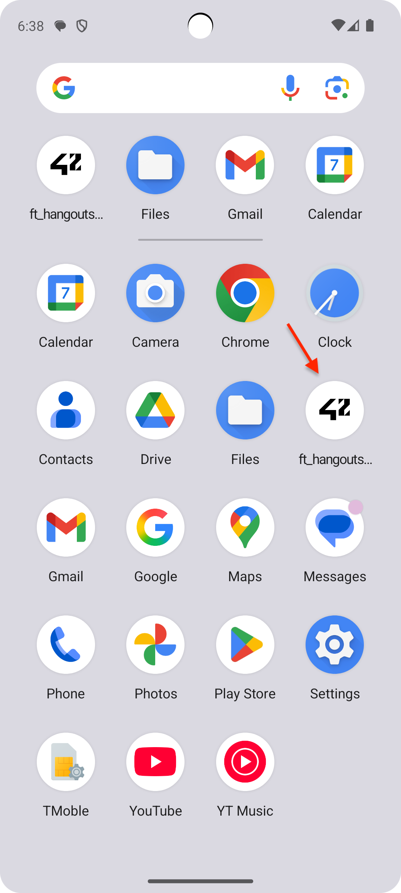
  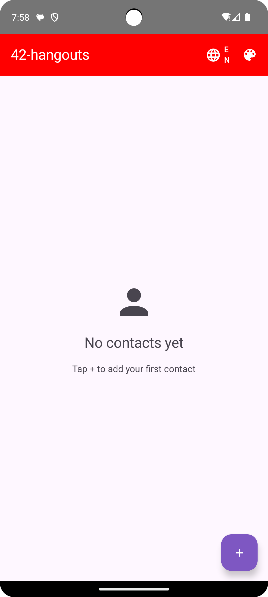
  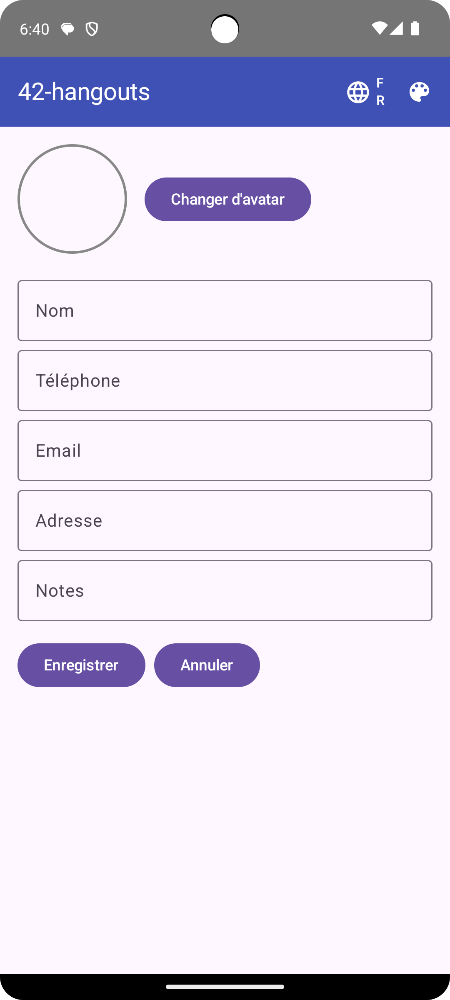
  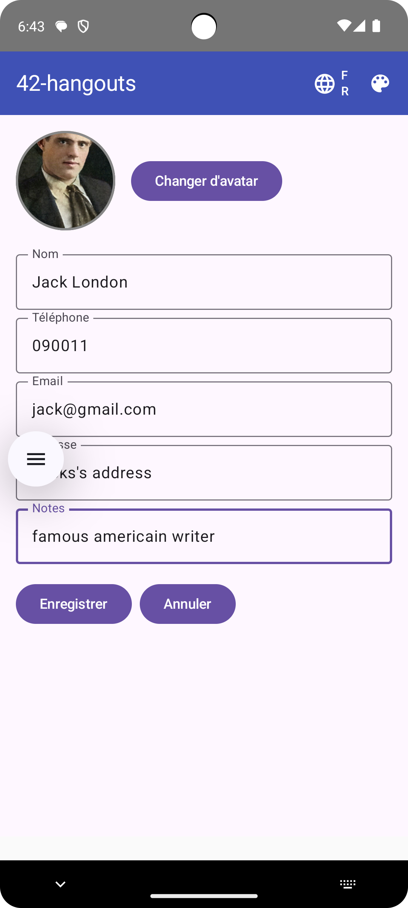
  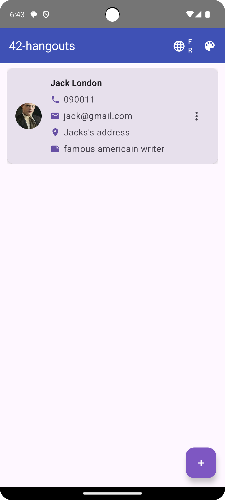
</p>

<p align="center">
  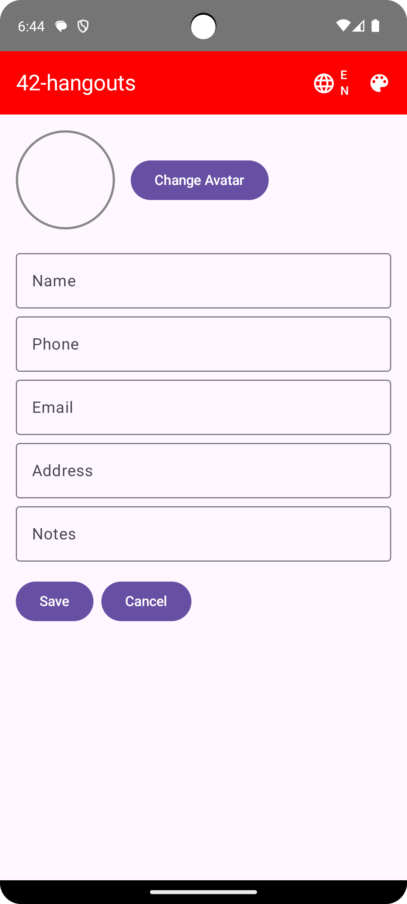
  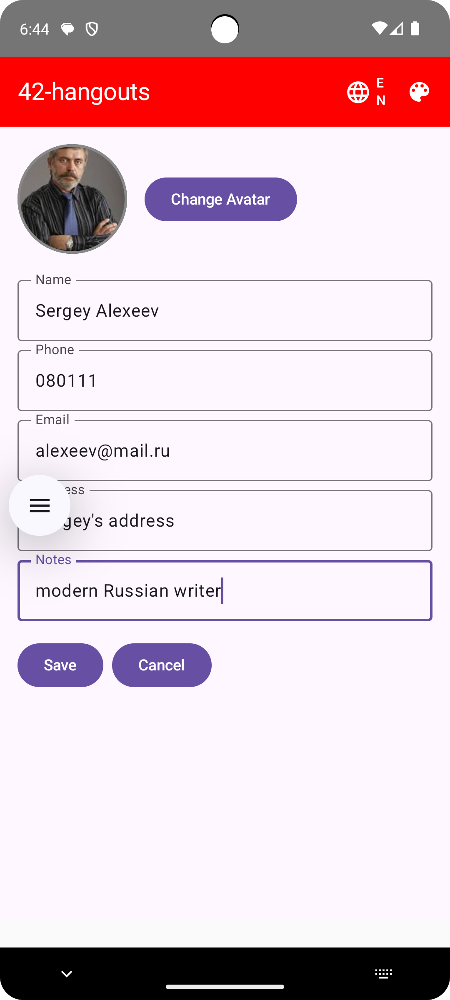
  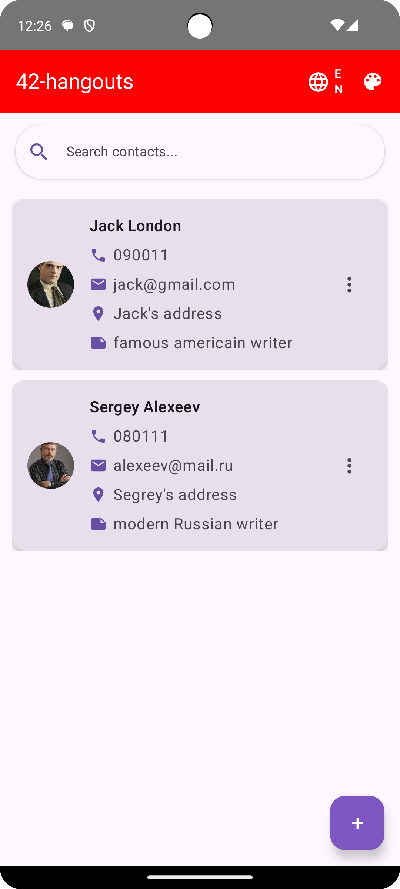
</p>

### Making Calls
1. Long-press on a contact card
2. Select **Call** from the context menu
3. Confirm call permission if prompted

<p align="center">
  
  
</p>

### Changing Language
- Tap the language icon (🌐) in the top bar
- Switches between English (EN) and French (FR)
- All UI elements, including search placeholders, are localized

<p align="center">
  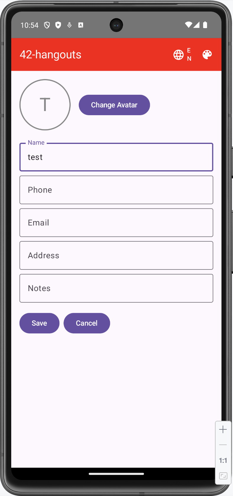
  
</p>

### Customizing Theme
- Tap the color palette icon (🎨) in the top bar
- Toggles between color schemes
- Settings are persisted across app restarts

<p align="center">
  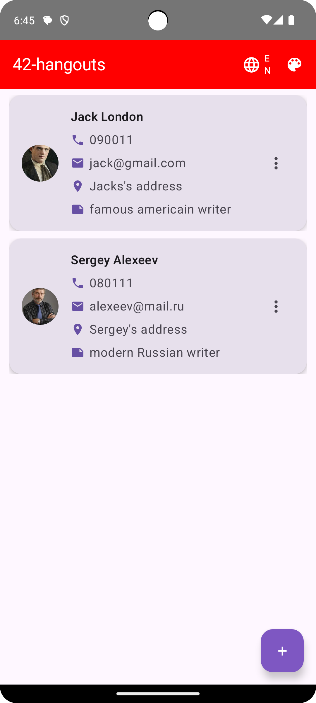
  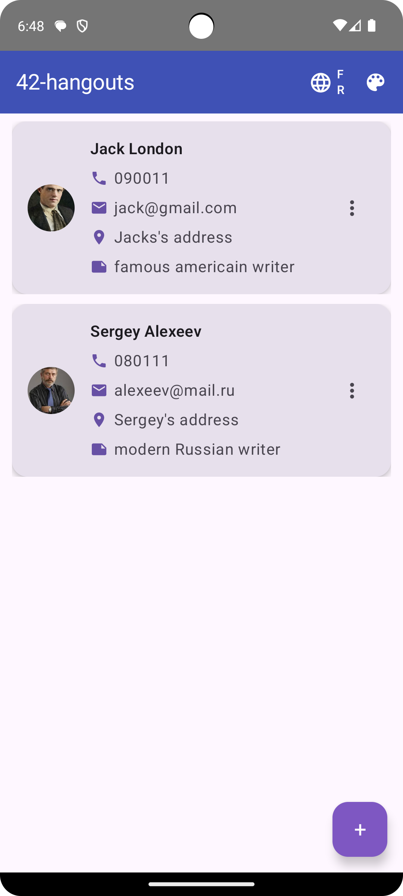
</p>

## 🔧 Technical Highlights

### Reactive Data Updates
The app uses Kotlin Flow for reactive data updates:
- Contact list automatically updates when database changes
- No polling required - updates happen instantly
- Efficient resource usage with Flow's backpressure handling

### Auto-Contact Creation
When an SMS is received from an unknown number, the app automatically:
1. Creates a new contact using the phone number as the name
2. Adds a note: "Auto-created from SMS"
3. Saves the incoming message
4. Updates the UI in real-time using Flow


### Error Handling
- Comprehensive error handling with `RepositoryException`
- User-friendly error messages displayed via Snackbar
- Graceful degradation when operations fail
- Proper error logging for debugging

### Input Validation
- Real-time validation for phone numbers and emails
- Visual feedback for invalid input
- Prevents invalid data from being saved
- Supports international phone number formats

### Modern Permission Handling
- Uses `ActivityResultLauncher` (modern Android API)
- Better user experience for permission requests
- Proper handling of permission denial
- Clear error messages when permissions are denied

### Database Migrations
- Proper migration handling for schema changes
- Data persistence during app updates
- Version management for database schema
- No data loss during migrations

## 🎯 Best Practices

1. **Reactive Programming**: Uses Kotlin Flow for real-time updates
2. **Error Handling**: Comprehensive error handling with user notifications
3. **Input Validation**: Validates user input before saving
4. **State Management**: ViewModel pattern for complex state
5. **Memory Management**: Application-scoped CoroutineScope prevents leaks
6. **Modern APIs**: Uses ActivityResultLauncher for permissions
7. **Material Design 3**: Follows latest Material Design guidelines
8. **Localization**: Full support for multiple languages
9. **Database Migrations**: Proper migration handling for schema changes
10. **Separation of Concerns**: Clear separation between UI, business logic, and data access

## 🐛 Known Issues & Limitations
- SMS functionality requires proper permissions on physical devices
- Avatar images are stored as file paths (may become invalid if original file is deleted)
- No dependency injection framework (Hilt/Dagger) - manual dependency management

## 🔮 Future Improvements
- Dependency Injection with Hilt
- Unit tests for repositories and ViewModels
- Integration tests for UI components
- Offline mode support
- Contact synchronization
- Message backup and restore
- Rich media support in messages
- Group messaging
- Contact groups/categories

## 📄 License
This project is part of the 42 School curriculum.

## 👨‍💻 Author
**Sergii Shevchenko**
- GitHub: [@sergiishevchenko](https://github.com/sergiishevchenko)

## 🙏 Acknowledgments
- 42 School for the project specifications
- Jetpack Compose documentation and community
- Material Design 3 guidelines
- Kotlin Coroutines and Flow documentation
